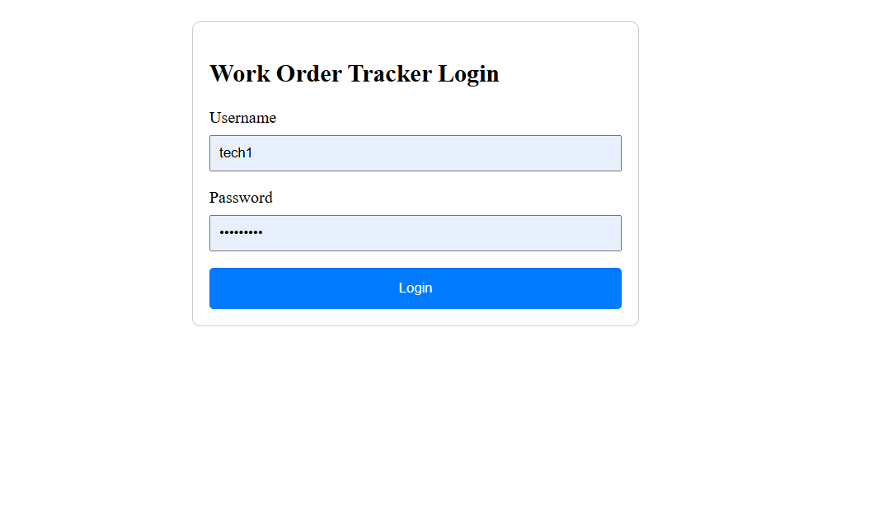
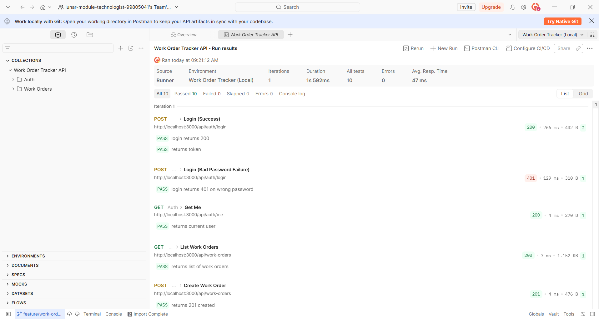

# Work Order Tracker

Work Order Tracker is a small full-stack application for managing maintenance work orders. It provides a TypeScript/Express API with JWT authentication, role-based permissions and CRUD operations for work orders, alongside a Vite-powered React web client.

## Screenshot

## Tech stack

- Node.js: v24.19.0
- npm: 11.17.0
- TypeScript: 7.0.2
- Express: 5.2.1
- React: 19.3.0
- Vite: 8.3.0
- Vitest: 5.0.1
- JSON Web Token: 9.0.3
- Zod: 4.6.5
- bcryptjs: 3.0.3

## Prerequisites

Install Node.js and npm before starting.

- Node.js: use Node.js 22 LTS or newer
- npm: use the npm version bundled with your Node.js installation
- The repository was built on Node.js version 24 and npm version 11

Check your installed versions:

```bash
node --version
npm --version
```

## Setup

1. Clone the repository and enter the project directory:

```bash
git clone https://github.com/your_username/work-order-tracker.git
cd work-order-tracker
```

2. Install dependencies in the root, server, and web folders:

```bash
npm install
```

3. If you want to run both frontend and backend servers create the environment file:

```bash
 cd work-order-tracker
 cp .env.example .env
```

The `.env.example` file has these variables:

- `PORT` — the port used by the Express API. It defaults to `3000` when omitted.
- `JWT_SECRET` — the secret used to sign and verify JWT access tokens. The server exits during startup if this variable is missing.
4. If you want to run the frontend server only create the environment file:

```bash
 cd work-order-tracker\web
 cp .env.example .env
```
The `.env.example` file has this variable:
- `VITE_API_BASE_URL`: It's a frontend environment variable, specifically for a Vite project. It holds the base URL your frontend uses to reach the backend API — e.g. http://localhost:4000.
5. If you want to run the backend server only create the environment file:

```bash
 cd work-order-tracker\web
 cp .env.example .env
```
The `.env.example` file has the same variables as the root folder

## Running the app

Start both the API server and web client from the repository root:

```bash
cd work-order-tracker
npm run dev
```

The services are available at:

- API server: `http://localhost:3000`
- API health check: `http://localhost:3000/health`
- Web client: `http://localhost:5173`

## Test credentials

Following is the test data:

| Username | Password | Role |
| --- | --- | --- |
| `admin` | `Passw0rd!` | `admin` |
| `tech1` | `Passw0rd!` | `tech` |

The `admin` user can delete work orders. The `tech1` user cannot delete work orders.

## Running the tests

Run all workspace tests:

```bash
npm test
```

Run server tests only:

```bash
npm run test --workspace server
```

Run server tests with coverage:

```bash
npm run test:coverage --workspace server
```

Run the web tests only:

```bash
npm run test --workspace web
```

The current server coverage report shows **75.73% statement coverage**, **61.76% branch coverage**, **78.78% function coverage**, and **78.20% line coverage**.

## API documentation

- Interactive API documentation: [`click here`](http://localhost:3000/docs)
- OpenAPI specification: [`docs/openapi.yaml`](./docs/openapi.yaml)

## Using the Postman collection

1. Open Postman.
2. Import the collection from `docs/work-order-tracker.postman_collection.json`.
3. Import the environment from `docs/work-order-tracker.postman_environment.json`.
4. Select the imported work-order environment from the environment selector in the upper-right corner of Postman.
5. Start the API server:

```bash
npm run dev --workspace server
```

6. Run the login request first. Use either of the test users:

```json
{
  "username": "admin",
  "password": "Passw0rd!"
}
```

7. Copy the returned `token` into the authorization header or tab in post to use protected requests

Note: These are the run summary results:

 
## Project structure
```
work-order-tracker/
├── .postman/     # Postman resources config
├── docs/         # API docs, OpenAPI spec, Postman collections, screenshots
├── postman/      # Postman workspace (collections, environments, globals)
├── server/       # Backend (Express/TS)
├── web/          # Frontend (React/TS)
├── .env          # Environment variables
├── .env.example  # Environment variable template
├── package.json  # Root package 
└── README.md     # Project details
```
## Design decisions

The application uses in-memory storage initialized from `server/src/data/seed.json`. This keeps the project easy to run without requiring a database, migrations, connection strings, or external infrastructure. It is appropriate for a small demonstration and makes tests quick and deterministic, but all newly created, updated, and deleted work orders are lost when the server restarts.

Authentication uses JWTs because the API can validate a signed token on each request without maintaining a server-side session store. The token is returned in the login response, while protected requests send it in the `Authorization: Bearer <token>` header. The current web client is only a minimal placeholder and does not yet implement a token-storage or login flow; Postman or another API client can hold the token during development.

Passwords are checked with bcrypt-compatible hashes, with the current test setup also accepting the documented `Passw0rd!` password directly. This keeps the seeded credentials usable for evaluation, but it is intentionally test-only behavior good for testing a minimum viable product.

## Known limitations and what I would do next

- The API uses in-memory storage, so data does not survive restarts and cannot be shared across multiple server instances. I could mongodb as a storage to persisit data
- The application does not have registration feature so I would implement this feature to register new users in a future storage
- The UI is minimal it is not aesthetic. I will ensure to follow standard UI design to improve the overall UI


